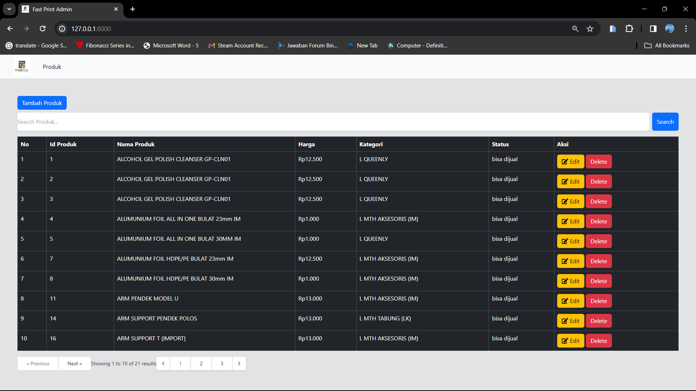
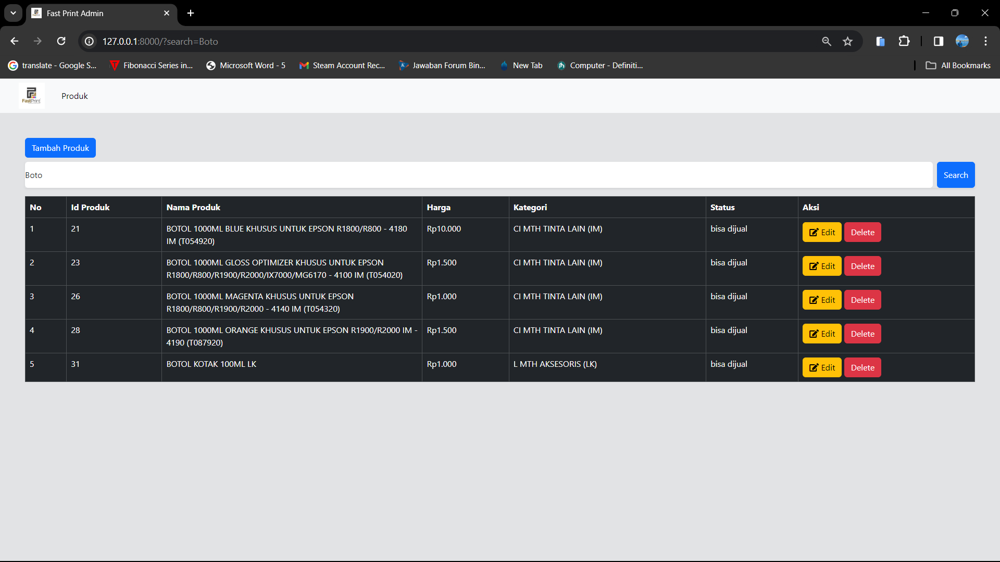
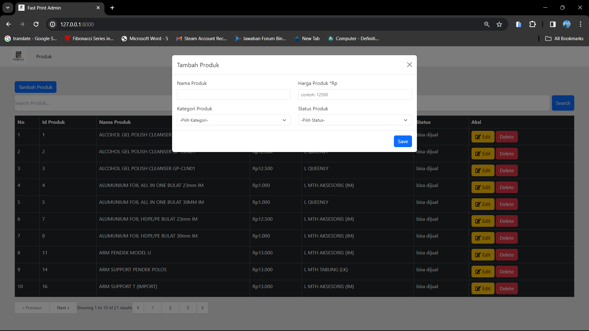
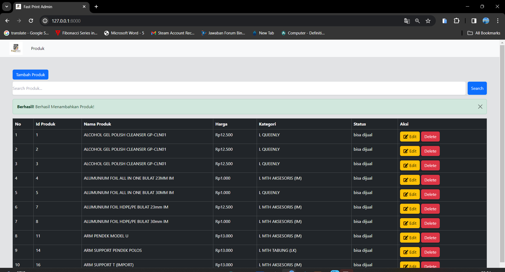
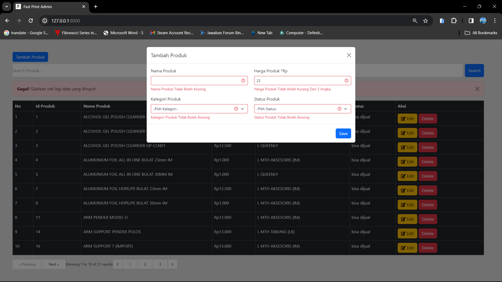
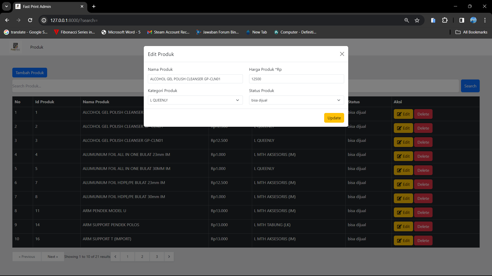
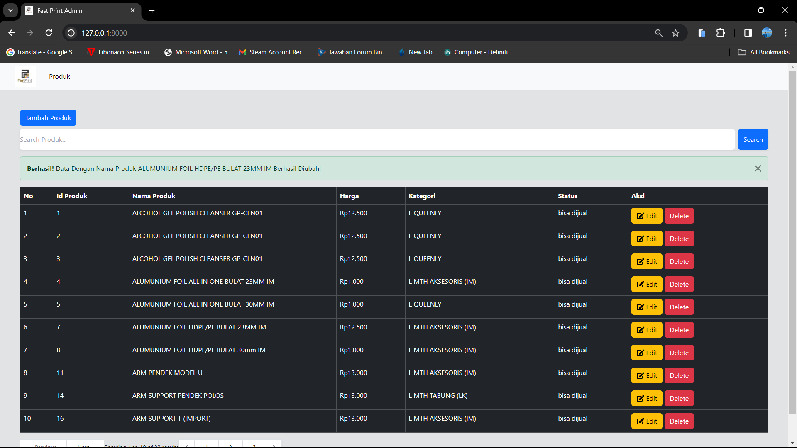
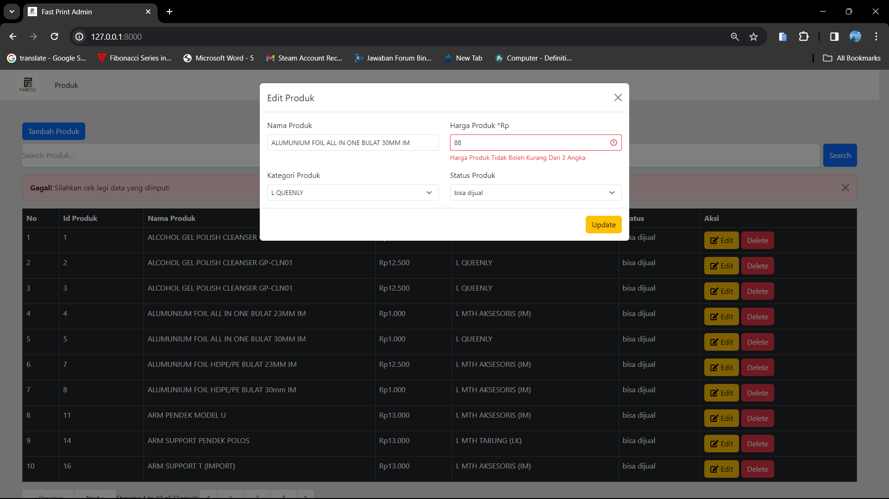
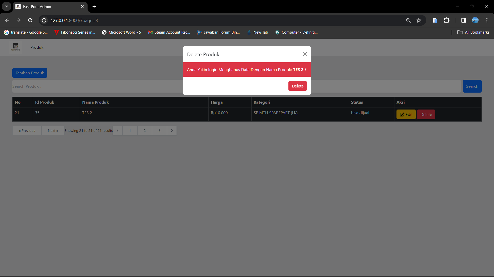
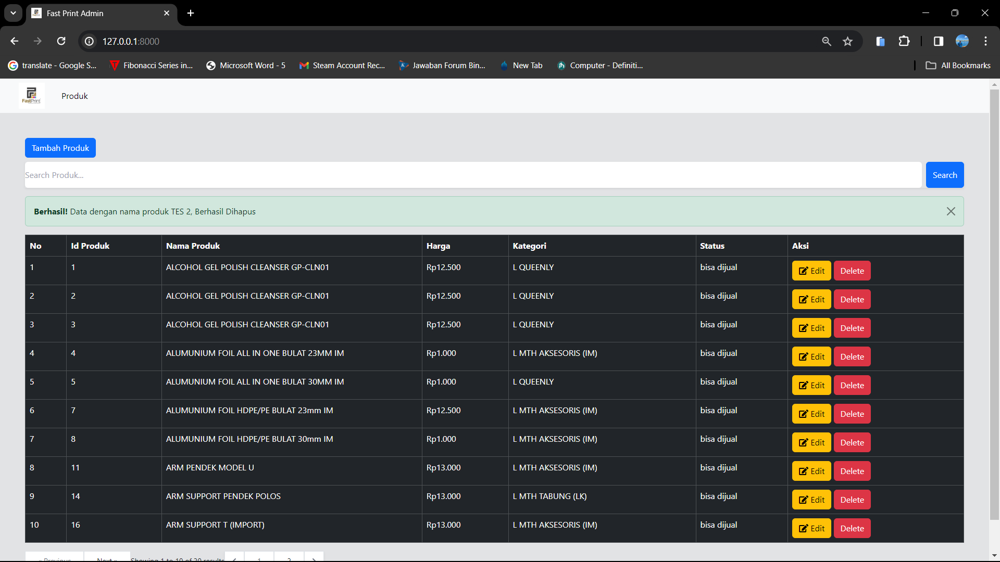

## Halo, Selamat Datang

-   Ini Aplikasi Yang Saya Kerjakan Untuk Test.

## Environment/env

-   .env terletak pada folder test_fastprint.
-   Kegunaan env yaitu untuk mengatur environment seperti URL, Database, Dll.

## Model

-   Model Terletak Pada Folder test_fastprint\app\Http\Controllers\Models.
-   Model Bertujuan Untuk Mengintegrasi Database Dengan Aplikasi.
-   User.php, Untuk Mengintegrasi Table User.
-   Produk.php, Untuk Mengintegrasi Table Produk.
-   Kategori.php, Untuk Mengintegrasi Table Kategori.
-   Status.php, Untuk Mengintegrasi Table Status.

## Routing

-   http://127.0.0.1:8000/ (Untuk Menampilkan Data Produk).
-   Berada di file web.php di dalam folder test_fastprint\routes.

## Views

-   Berada di folder test_fastprint\resources\views.
-   welcome.blade.php (Halaman Utama Template).
-   navbar.blade.php (Untuk Menampilkan Navbar Dan Di@include Di file welcome.blade.php)
-   produk.blade.php (Content Yang Akan Ditampilkan Di Halaman Utama).
-   add_produk.blade.php (Halaman Untuk Menambah Data Produk Yang Berupa Modal). Ketika Submit, Form Akan Diarahkan Ke route dengan nama produk.store.
-   edit_produk.blade.php (Halaman Untuk Mengubah Data Produk Yang Berupa Modal). Ketika Submit, Form Akan Diarahkan Ke url produk/{id_produk}.
-   delete_produk.blade.php (Halaman Untuk Menghapus Data Produk Yang Berupa Modal). Ketika Submit, Form Akan Diarahkan Ke route dengan nama produk.delete.

## Controller

-   Controller Berada Pada Folder test_fastprint\app\Http\Controllers.
-   ProdukController, Controller Utama Untuk Menampilkan, Menambah, Mengubah, Dan Menghapus Data. Data Di Controller Akan Di Validasi Di Request.

## Request

-   Request Berada Pada Folder test_fastprint\app\Http\Requests.
-   StoreProdukRequest, Bertujuan Untuk Memvalidasi Data Yang Akan Disimpan Ke Dalam Database, dan Akan Dikirimkan Kembali Ke Controller.
-   UpdateProdukRequest, Bertujuan Untuk Memvalidasi Data Yang Akan Diubah Lalu Disimpan Ke Dalam Database, dan Akan Dikirimkan Kembali Ke Controller.

## Bug

-   Saat ini Hanya Terdapat Bug Pada Saat Update Data Dikarenakan Data Dengan nama_produk mempunyai data lebih dari 1 (Pertama Kali Saat Saya Mendapatkan Data, Dan Saya Tidak Ingin Mengubahnya Dikarenakan Data Disediakan Oleh Pihak Pembuat Tes). Ini Dikarenakan Saya Menghadirkan Fitur Unique Pada nama_kategori, data nama_kategori tidak boleh lebih dari 1 saat menambahkan data (StoreProdukRequest.php). Tetapi, Untuk Edit Data, Sudah Saya Kecualikan (UpdateProdukRequest.php).

## Contoh Tampilan / Screenshot

-   Tampilan ada di folder test_fastprint\public\assets\img.

## Halaman Utama

-   Halaman Utama
    

## Search Bar

-   Search Bar
    

## Tambah Produk

-   Tambah Produk
    

-   Tambah Produk Berhasil
    

-   Tambah Produk Error
    

## Edit Produk

-   Edit Produk
    

-   Edit Produk Berhasil
    

-   Edit Produk Error
    

## Delete Produk

-   Delete Produk
    

-   Delete Produk Berhasil
    
